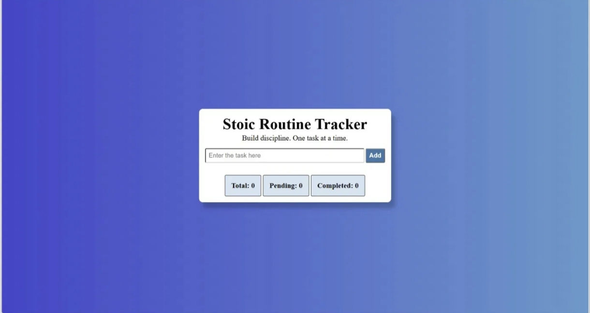

# Stoic Routine Tracker

A simple, clean task-tracking web app to help users build daily discipline — one task at a time.

**Live Demo:** [https://divyanshusingh03.github.io/stoic-routine-tracker/](https://divyanshusingh03.github.io/stoic-routine-tracker/)



---

## Features

- **Add tasks** — quickly add a new task to your daily routine
- **Input validation** — if the input is empty or contains only spaces, an alert prompts the user to enter a valid task, and no empty task is added
- **Mark as Pending / Completed** — toggle task status with a single click
- **Delete tasks** — remove tasks you no longer need
- **Live task stats** — see Total, Pending, and Completed counts update in real time
- **Data persistence** — tasks are saved in the browser using `localStorage`, so your list stays intact even after refreshing or closing the tab

---

## Tech Stack

- **HTML** — page structure
- **CSS** — styling and layout
- **JavaScript (Vanilla JS)** — task logic, DOM manipulation, and localStorage handling

No frameworks or external libraries were used — this project was built from scratch to strengthen core web development fundamentals.

---

## How It Works

1. User types a task into the input field and clicks **Add**
2. The task is rendered on the page and saved to `localStorage`
3. Clicking a task toggles its status between **Pending** and **Completed**
4. Deleting a task removes it from both the UI and `localStorage`
5. On page reload, tasks are read back from `localStorage` and re-rendered — so nothing is lost

---

## Run Locally

1. Clone the repository
   ```bash
   git clone https://github.com/divyanshusingh03/stoic-routine-tracker.git
   ```
2. Navigate into the project folder
   ```bash
   cd stoic-routine-tracker
   ```
3. Open `index.html` directly in your browser — no build steps or dependencies required

---

## Roadmap (Planned Improvements)

- [ ] Improve UI/UX with better spacing, typography, and hover states
- [ ] Add empty-state message when no tasks exist
- [ ] Add task editing functionality
- [ ] Add due dates / reminders for tasks
- [ ] Migrate to a framework-based version (React) as a v2

---

## Author

**Divyanshu Singh**
B.Tech CSE, Amity University
[LinkedIn](#) · [GitHub](https://github.com/divyanshusingh03)
